# handspan

Computer-use automation for legacy back-office banking systems: an LLM discovers how to
complete a task in a real UI with no API, the successful run is compiled into a typed,
reviewable **capability** artifact, and that artifact replays **deterministically**
afterward with no model in the loop.

Built for interface.ai's take-home ("Computer-Use Automation System"). See
[`REPORT.md`](REPORT.md) for the design write-up (architecture, artifact schema,
determinism & error handling, heterogeneity & multi-tenant, escalation & handoff, safety,
cuts), and [`DEVELOPMENT_LOG.md`](DEVELOPMENT_LOG.md) for the reasoning path — the order
things were built in, the decisions made before any code was written, and the real bugs
found by testing against a live browser (with root causes), rather than just the
justified end state.

## What's here

- **Target surface** (`target-app/`): a deliberately hostile mock legacy banking app —
  frameset shell, table layout, randomized element ids on every render, no test ids, a
  native `confirm()` on the one irreversible action, and injectable runtime faults
  (session timeout, app error, validation failure, slow load). Two variants
  (`base`, `riverbend`) stand in for two tenants running the same vendor product,
  configured and branded differently.
- **Discovery** (`src/agent/`): an `observe → decide → act` loop where an LLM
  (`claude-opus-5`) drives the app through a *semantic* view (role + accessible name +
  inferred caption + containment — never raw HTML or CSS selectors), then a
  model-free compiler turns the recording into a capability, auditing every checkpoint
  and locator along the way (see `REPORT.md` §2–3).
- **Replay** (`src/replay/`): the production execution path. No model. Resolves each
  step's target against the current screen, verifies checkpoints, classifies the
  screen against the app's declared exceptional-state rules, and returns a typed
  result: `success`, `business_outcome`, `escalated`, or `failure`.
- **Policy** (`src/policy/`): one allowlist/risk gate every action passes through, and
  one redactor every byte written to disk passes through.
- **Escalation** (`src/session/`, `src/escalation/`): a control-lease model (automation
  ⇄ operator, with a monotonic epoch) plus a real, minimal operator console — take
  control of the *live* session, click/type on the real page, hand back.
- **Catalog** (`src/catalog/`): saved capabilities exposed as a JSON tool-definition
  list an AI agent could call by name (`catalog --tools`).

## Setup

Requires Node ≥ 20.

```bash
npm install
npx playwright install chromium   # if not already cached
```

Copy `.env.example` to `.env` (already done in this checkout) — it holds only the
**mock target app's** login for its own synthetic service account, never a real
credential:

```
TARGET_APP_USER=svc.agent
TARGET_APP_PASSWORD=Passw0rd!demo
```

### LLM provider

Discovery needs a real model call. Two providers, auto-selected:

- If `ANTHROPIC_API_KEY` is set → the Anthropic Messages API directly (`src/agent/planner.ts`
  `AnthropicPlanner`), `claude-opus-5`, strict single-tool contract.
- Otherwise → the locally-authenticated `claude` CLI, driven headlessly as a bare model
  endpoint (`ClaudeCliPlanner`): no tools, no persona, JSON-only output, same decision
  schema and same parser. This is what the checked-in evidence in `/evidence/` was
  produced with — it requires `claude` to be installed and already logged in
  (`claude auth login` or an active session), nothing else.

Override with `--planner anthropic-api|claude-cli` and `--model <id>` on any `discover`
call.

### Run without live services

Replay needs the target app running but needs **no** model and **no** network beyond
`127.0.0.1`. The whole replay path, policy engine, resolver, and escalation mechanism
run and are unit-tested (`npm test`) with zero external dependencies. Only `discover`
needs an LLM.

## Demo path

The exact commands, in order. `npm run demo` runs all of this for you (starts the app,
does one real discovery, replays the result three ways, then stops the app) — see
below for the one-liner, or run it by hand:

```bash
# Terminal 1 — the target app (base tenant)
npm run app                          # http://127.0.0.1:8078

# Terminal 2 — discover a capability with a real LLM run
npm run cua -- discover --goal goals/lookup-member-savings-balance.json --model claude-opus-5
# → writes capabilities/lookup_member_savings_balance.json
# → evidence in evidence/discovery-<runId>/ (journal, screenshots, transcript.jsonl)

# Replay it — deterministic, no model in the loop
npm run cua -- replay --capability capabilities/lookup_member_savings_balance.json \
  --input memberId=12345
# → {"status":"success","outputs":{"regular_savings_balance":"4,812.63",...}}

# Same artifact, a DIFFERENT member — proves it's a reusable capability, not a script
# pinned to one record
npm run cua -- replay --capability capabilities/lookup_member_savings_balance.json \
  --input memberId=23456

# Same artifact, a member that doesn't exist — a legitimate business outcome, not a crash
npm run cua -- replay --capability capabilities/lookup_member_savings_balance.json \
  --input memberId=54321
# → {"status":"business_outcome","outcome":{"code":"RECORD_NOT_FOUND",...}}

# Inject a runtime fault and watch replay detect + recover from it
npm run cua -- replay --capability capabilities/lookup_member_savings_balance.json \
  --input memberId=12345 --fault session
# → still succeeds; result.recoveries shows SESSION_SIGNON_REQUIRED was cleared
```

One command for all of the above:

```bash
npm run demo
```

### The irreversible flow + human escalation

```bash
# Discover the sub-account opening flow. It hits a risky (irreversible) step during
# discovery itself; a scripted "operator" approves it live over the same session
# (a real control-lease handoff, not a stub) so discovery can finish.
npm run cua -- discover --goal goals/open-member-subaccount.json --model claude-opus-5 \
  --operator-sim approve --escalation-wait 60000

# Replay WITHOUT authorization is refused by policy:
npm run cua -- replay --capability capabilities/open_member_subaccount.json \
  --input memberId=23456 --input nickname="VACATION FUND" --input initialDeposit=25.00
# → {"status":"failure","failure":{"code":"CONFIRMATION_REQUIRED",...}}

# Replay WITH an explicit confirmation:
npm run cua -- replay --capability capabilities/open_member_subaccount.json \
  --input memberId=23456 --input nickname="VACATION FUND" --input initialDeposit=25.00 --confirm

# Or replay with a live operator approving each risky step through the same
# control-lease mechanism (no --confirm needed — the human IS the confirmation):
npm run cua -- replay --capability capabilities/open_member_subaccount.json \
  --input memberId=23456 --input nickname="VACATION FUND" --input initialDeposit=25.00 \
  --operator-sim approve --escalation-wait 30000
```

### The real operator console

`--operator-sim` above stands in for a human so the flow is scriptable in CI (see
`REPORT.md` §5 for why, and what it does and doesn't stub). To drive the **actual**
console instead:

```bash
npm run cua -- replay --capability capabilities/open_member_subaccount.json \
  --input memberId=23456 --input nickname="VACATION FUND" --input initialDeposit=25.00 \
  --console 8090
# then open http://127.0.0.1:8090 — it lists interventions as they're raised; click
# through to one, "Take control", click/type directly on the live screenshot, then
# "Resume automation" (or "I completed it manually" / "Abort run").
```

### Multi-tenant reuse (no re-recording)

```bash
# Terminal 3 — a second tenant on the SAME vendor product, different config/branding
npm run app:riverbend                # http://127.0.0.1:8079

# The SAME artifact recorded against the base tenant, replayed against riverbend —
# different field captions, different routes, an extra post-login compliance notice —
# via a small tenant overlay (tenants/riverbend.json), zero re-recording:
npm run cua -- replay --capability capabilities/lookup_member_savings_balance.json \
  --tenant tenants/riverbend.json --input memberId=12345
```

### Other useful commands

```bash
npm run cua -- catalog                 # list saved capabilities
npm run cua -- catalog --tools         # emit them as agent-callable tool definitions
npm run cua -- invoke lookup_member_savings_balance --input memberId=12345   # call by name
npm run cua -- approve --name lookup_member_savings_balance --by "you@org.com"
npm run cua -- stability --capability capabilities/lookup_member_savings_balance.json \
  --input memberId=12345 --runs 5     # replay N times, report a flakiness signal
npm test                               # unit tests (resolver, predicates, redaction, policy, desktop-surface seam)
npm run typecheck
```

## Showcase: one real end-to-end run

Everything below is from one un-cherry-picked pass through the system, using the exact
commands from **Demo path** above — real `claude-opus-5` discovery against the live app,
real deterministic replay, a real injected fault, and a real human taking control of the
live session through the actual console (no mock UI, no pre-scripted screenshots).
Screenshots are in [`docs/screenshots/`](docs/screenshots/); the runs that produced them
are the fresh `evidence/discovery-*` and `evidence/replay-*` directories alongside the
originally curated ones described in **Evidence** below. Synthetic data throughout — see
`target-app/data.ts`.

### 1. Discovery: an LLM learns the flow

```
npm run cua -- discover --goal goals/lookup-member-savings-balance.json --model claude-opus-5
```

One screenshot per turn — this is the model observing, deciding, and acting against the
live frameset with no test ids and randomized element ids, with nothing to go on but
role + accessible name + inferred caption, exactly as a human operator would read it:

| | |
|---|---|
| 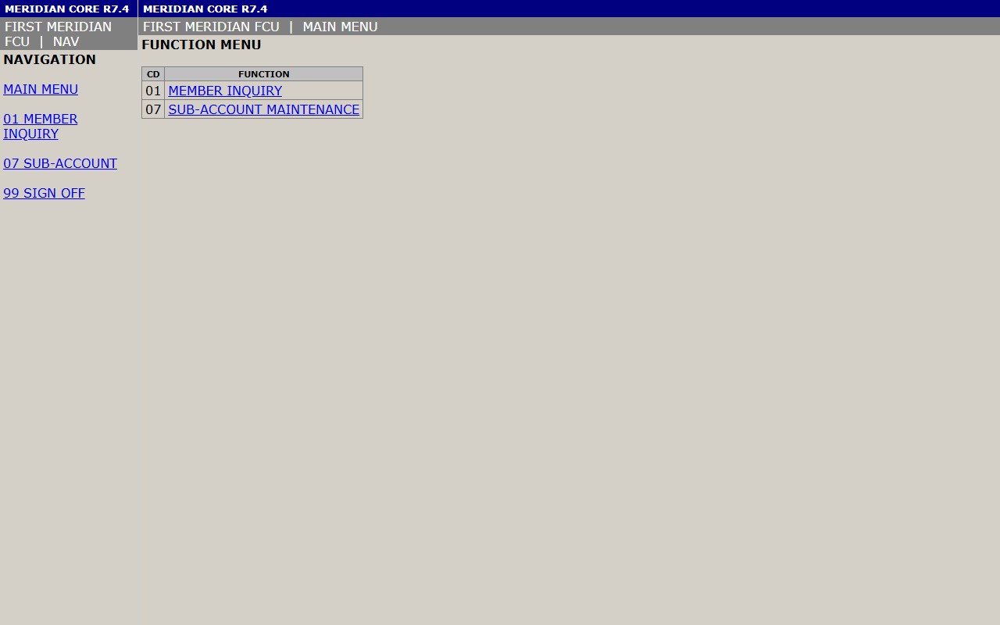 **1. Decides to open MEMBER INQUIRY** from the frameset's function menu. | 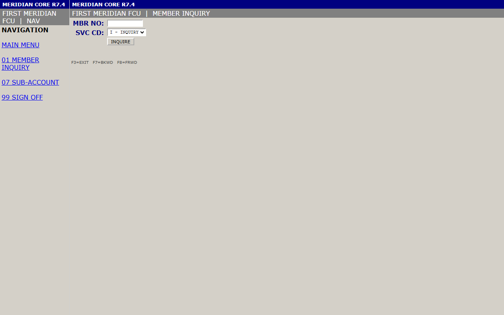 **2. Reaches the inquiry screen**, decides to type the member number into `MBR NO:`. |
| 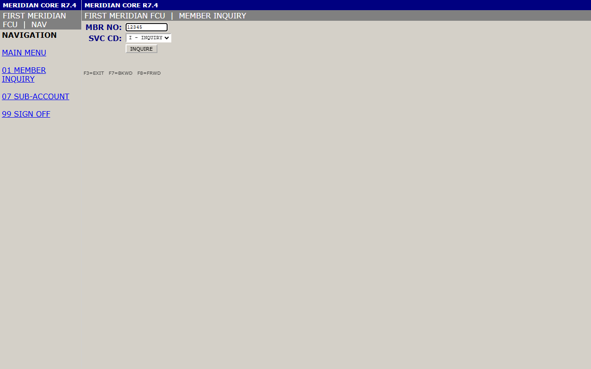 **3. `12345` entered**, decides to click `INQUIRE`. | 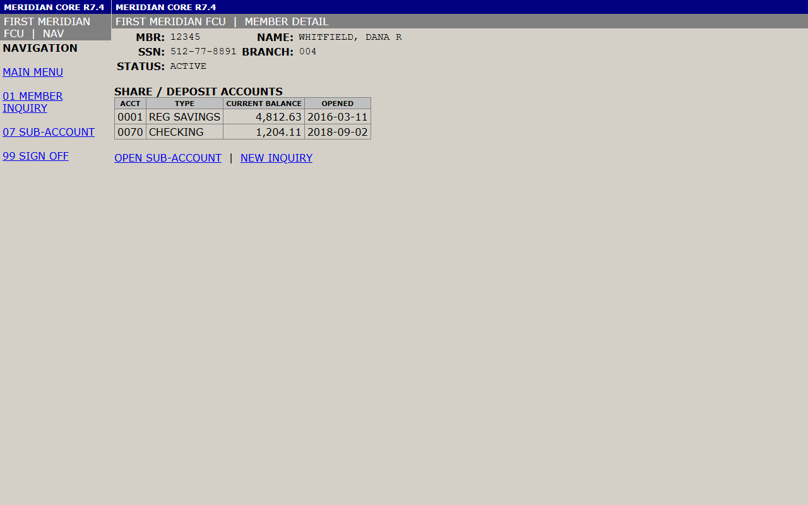 **4. Goal reached** — MEMBER DETAIL shows the REG SAVINGS balance (`4,812.63`) the goal asked for. |

4 LLM calls, 3 actions, one compiled artifact. The compiler's own audit immediately
earned its keep on this run — see **Determinism & error handling** in `REPORT.md`:

```
[compile] WARNING step s2: dropped the planner's expectation ("MEMBER DETAIL") — it was not literal screen text
[compile] WARNING output "regular_savings_balance": dropped data-valued label(s) [0001]; locator re-verified without them
```

### 2. Deterministic replay: the same artifact, three ways — no model in the loop

```
npm run cua -- replay --capability capabilities/lookup_member_savings_balance.json --input memberId=12345
npm run cua -- replay --capability capabilities/lookup_member_savings_balance.json --input memberId=23456
npm run cua -- replay --capability capabilities/lookup_member_savings_balance.json --input memberId=54321
```

The recorded-for-`12345` artifact, replayed against a **different member it never saw
during discovery**, still resolves every locator and returns the right data — proof it's
a reusable capability, not a script pinned to one record:

```json
// memberId=23456 — same artifact, different member
"outputs": { "regular_savings_balance": "150.00", "member_name": "OYELARAN, MARCUS T", ... }
```

And a member that doesn't exist is a **business outcome**, not a crash:

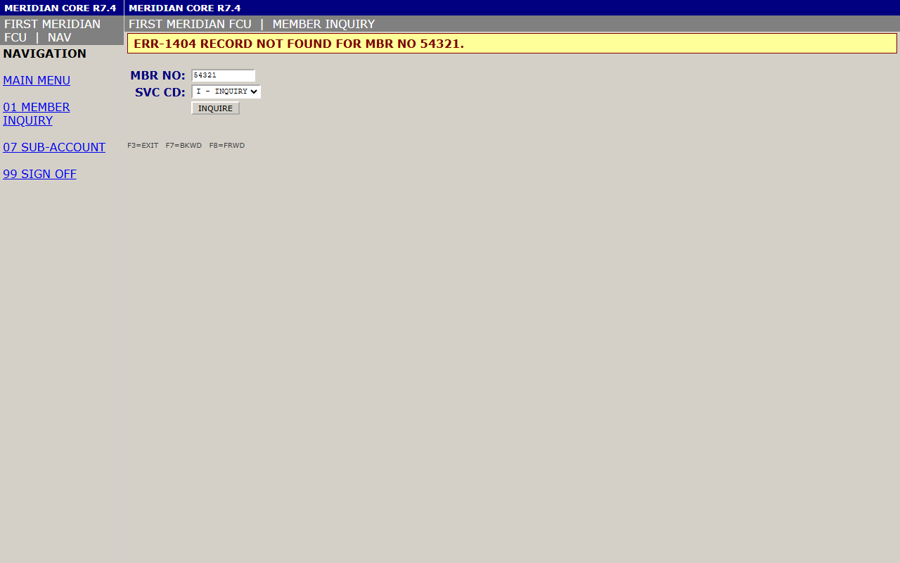

```json
// memberId=54321
"status": "business_outcome",
"outcome": { "code": "RECORD_NOT_FOUND", "message": "No member record exists for the supplied member number" }
```

(Replay only saves a screenshot on failure/escalation by design — a success or a clean
business outcome doesn't need a human to look at it. The image above was captured
directly against the same live app for illustration; the JSON is the actual replay
output.)

### 3. Multi-tenant reuse: the same artifact, a different institution, zero re-recording

```
npm run cua -- replay --capability capabilities/lookup_member_savings_balance.json \
  --tenant tenants/riverbend.json --input memberId=12345
```

Recorded once against the base tenant; replayed here against `riverbend` — different
branding, different routes, a forced post-login compliance notice the base tenant doesn't
have. The overlay maps the label differences (`SAVINGS BALANCE` vs `REG SAVINGS`,
`SHARE DRAFT` vs `CHECKING`), and the run self-recovered the extra notice on its own
(`recoveries: [..., "MAINTENANCE_NOTICE"]`, `drift.changed: true` — flagged, not fatal):

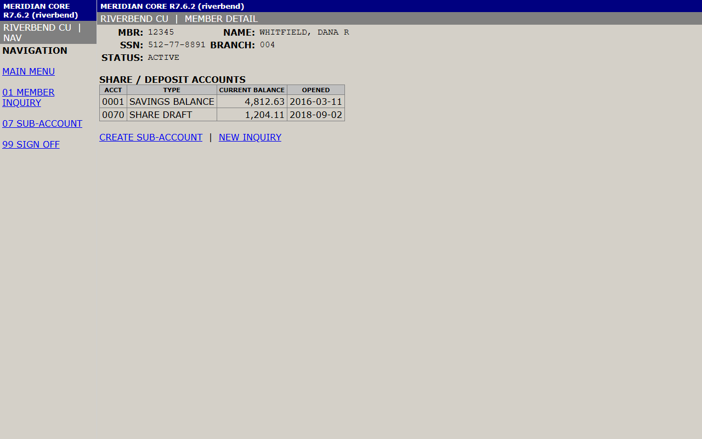

### 4. The irreversible flow, discovered live — and paused for a real decision

```
npm run cua -- discover --goal goals/open-member-subaccount.json --model claude-opus-5 \
  --operator-sim approve --escalation-wait 60000
```

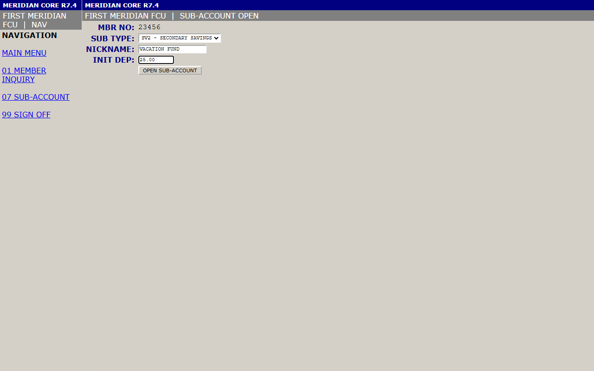

The planner filled the form and decided to click `OPEN SUB-ACCOUNT` — an `irreversible`
action. Policy requires confirmation for that risk class, so discovery **paused before
the click executed** and raised a real intervention:


`--operator-sim approve` stands in for a human here (see **Escalation & handoff** below
for the real console); once approved, discovery clicked through, answered the resulting
native confirmation dialog itself, and reached the posting confirmation:

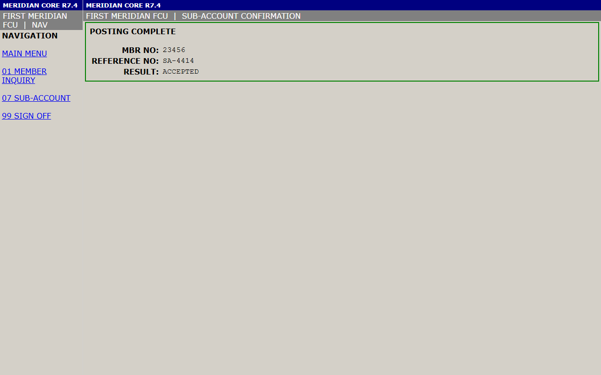

Reference `SA-4414`, result `ACCEPTED` — a real write against the mock core, gated the
whole way by policy, not by hope.

### 5. Replay hits a hard fault — a real human takes control of the live session

```
npm run cua -- replay --capability capabilities/lookup_member_savings_balance.json \
  --input memberId=12345 --fault error500 --console 8090 --escalation-wait 90000
```

No `--operator-sim` this time — the console at `http://127.0.0.1:8090` is driven exactly
the way a person would: open the queue, open the intervention, take control, act on the
*live* page, hand back.

| | |
|---|---|
| 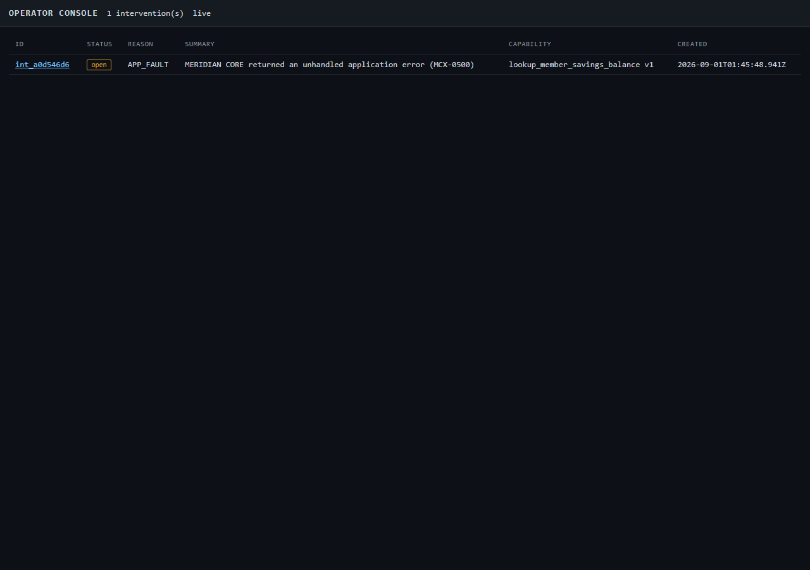 **1. Queue** — `APP_FAULT`: the app returned MCX-0500 on the very first screen. | 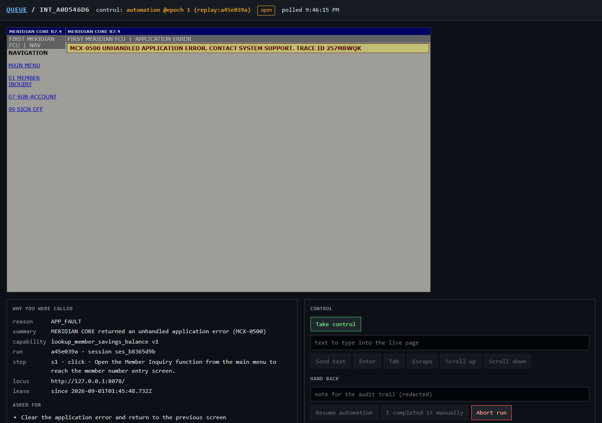 **2. Detail view** — the live broken page, full context (reason, capability, run/session id, locus, lease), before anyone has taken control. |
| 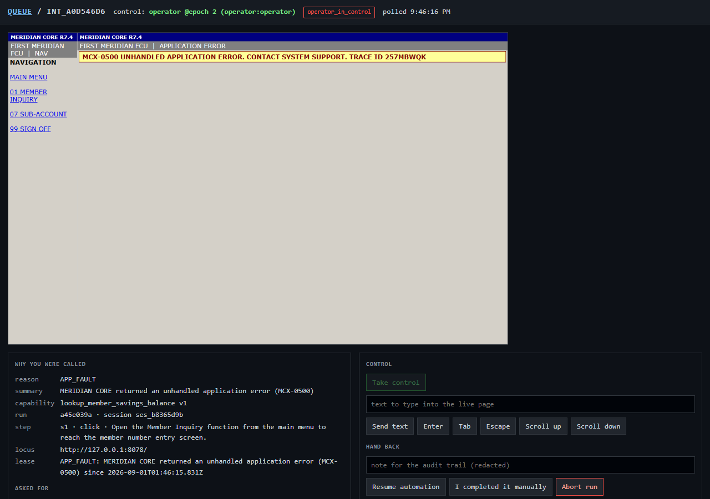 **3. Take control** — the lease flips to `operator @epoch 2`; the live page is now clickable through the console. |  **4. Acts on the live page** — clicks `MAIN MENU` in the real nav frame. The fault fired *before* the automation had signed on, so this honestly lands on SIGN ON, not the menu — not scripted around. |

The operator hands back with a note (typed through the console into the same audit
trail the redactor protects):

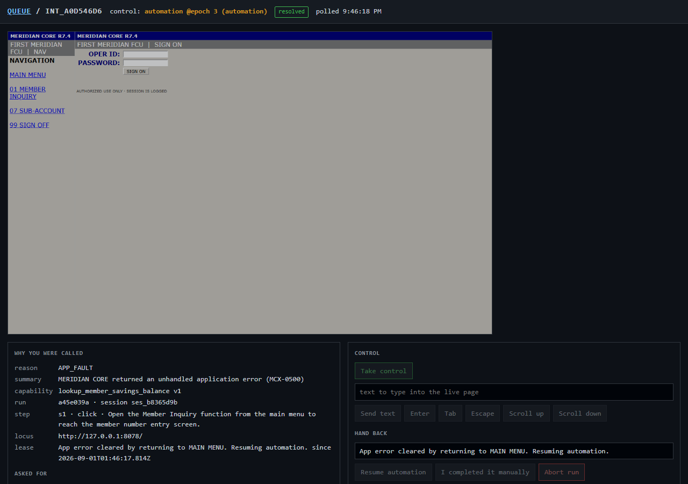

Control returns to `automation @epoch 3`. The automation didn't need to be told how to
finish: `SESSION_SIGNON_REQUIRED` is the same self-healing recovery rule every replay
above already exercised, so it just signed back in with the service account and retried
the interrupted step:

```json
"status": "success",
"escalation": { "reason": "APP_FAULT", "resolvedBy": "operator:operator", "resumed": true },
"recoveries": [{ "code": "SESSION_SIGNON_REQUIRED", "ok": true }]
```

A hard application fault, escalated with full context, resolved by a real person acting
on the real live session, handed back, and finished — the seam Section 3.6 asks for,
exercised end to end.

## Evidence

`/evidence/` (committed) contains, from real runs against this repo's target app:

- `discovery-lookup-final/`, `discovery-subacct-final/` — full discovery runs: journal,
  per-turn screenshots, and `transcript.jsonl` with the actual model requests/responses
  and Anthropic usage/cost (proof the LLM run is genuine, not simulated).
- `replay-evidence-clean/` — a clean successful replay.
- `replay-evidence-notfound/` — a business outcome (`RECORD_NOT_FOUND`), not a crash.
- `replay-evidence-fault-session/` — an **injected** session-timeout fault, detected and
  self-recovered mid-replay (see `result.recoveries` and the `journal.jsonl`
  `monitor.recovery` / `recovery.start` / `recovery.end` events).
- `replay-evidence-fault-apperror/` — an **injected** hard application-error fault:
  correctly classified as a fault (not a business outcome), escalated, and — since no
  operator answered within the wait window — reported as `escalated` with full context,
  never silently retried.
- `replay-subacct-escalate-approved/` — the irreversible sub-account flow, replayed with
  **no** `--confirm`, approved live through the real control-lease handoff instead.
- `replay-subacct-final-replay/` — the same flow with an explicit `--confirm`.
- `replay-riverbend-lookup/`, `replay-riverbend-notfound/` — the base-tenant artifact
  replayed against the `riverbend` variant via overlay.
- `replay-stab1..3-*/`, `stability.json` — a 3-run stability check: 3/3 success,
  byte-identical output shape (`deterministic: true`).
- `interventions/` — the raised `InterventionRequest` records from the escalation runs
  above, including the resolution and the (redacted) human actions taken.
- `discovery-607bebb6/`, `discovery-4f7a729a/`, `replay-703118b9/`, `replay-e695f8e7/`,
  `replay-d1b5e159/`, `replay-ea8af214/`, `replay-0b5fc03d/`, `replay-a45e039a/` — the
  fresh, un-cherry-picked run behind **Showcase** above (2026-08-31): the same discovery,
  replay, multi-tenant, and escalation scenarios, captured start to finish in one sitting.
  `replay-a45e039a` is the fullest one — a real console-driven escalation that resolves
  cleanly to `success`, which the originally curated runs above don't otherwise cover.

Every journal, observation snapshot, and frame-source dump under `/evidence/` has passed
through the same `Redactor` that guards the live run — see `REPORT.md` §6. Screenshots are
the one exception (raw pixels, not redacted text) — also documented there.

## Project layout

```
src/core/        artifact schema, target/locator vocabulary, predicates, resolver
src/policy/      allowlist + risk gate, redaction
src/surface/     Surface interface; web (Playwright) implementation; desktop seam (typed, stubbed)
src/session/     control lease, the one choke point every action passes through
src/replay/      deterministic replay engine, state classification, output extraction
src/agent/       discovery loop, prompting, locator synthesis, recording → artifact compiler
src/escalation/  intervention bus, operator console (real HTTP+HTML), scripted operator
src/obs/         evidence journal
src/catalog/     capability catalog / agent tool-definition surface
src/cli/         one CLI: discover, replay, invoke, catalog, approve, stability, operator
target-app/      the mock legacy banking surface
app-profiles/    per-vendor-product shared exceptional-state rules (auth, recovery, faults, outcomes)
goals/           discovery job specs (goal + typed params)
tenants/         per-tenant overlays (label synonyms, entry override, step patches)
policy/          the guardrail configuration
test/            vitest unit tests for the pure core
evidence/        committed evidence from real runs (see above)
```

## What's mocked, and why

Per the brief's scope note: the operator console is real (a real HTTP server, a real
page, real click/type forwarded to the live session) but minimal — no auth, no
multi-operator queueing, no co-browsing video. `--operator-sim` (a scripted playbook
using the *same* `surface.operator.*` input path a human would) exists so the escalation
and control-transfer mechanism is exercised in an automated, reproducible way without a
person at a keyboard; it never bypasses the lease or the input path a real operator uses.
The desktop surface (`src/surface/desktop/`) is a fully-typed, structurally real
implementation of the `Surface` interface with working role/control mapping functions —
the parts that prove the abstraction — but its I/O methods are stubs (`SurfaceError`
"not implemented"), since no desktop app was in scope. See `REPORT.md` §7 for the full
list of cuts and next steps.
